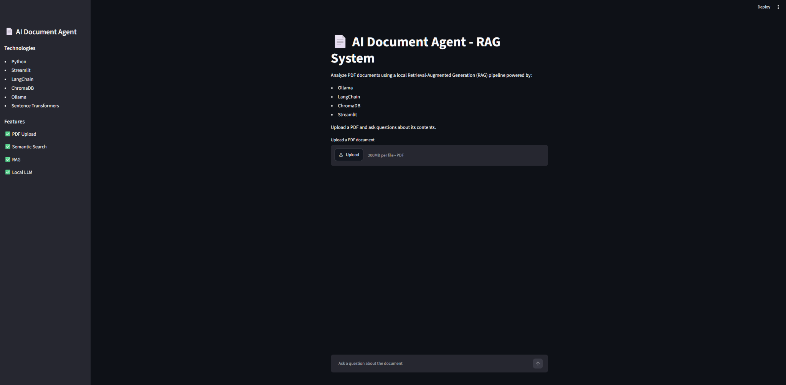
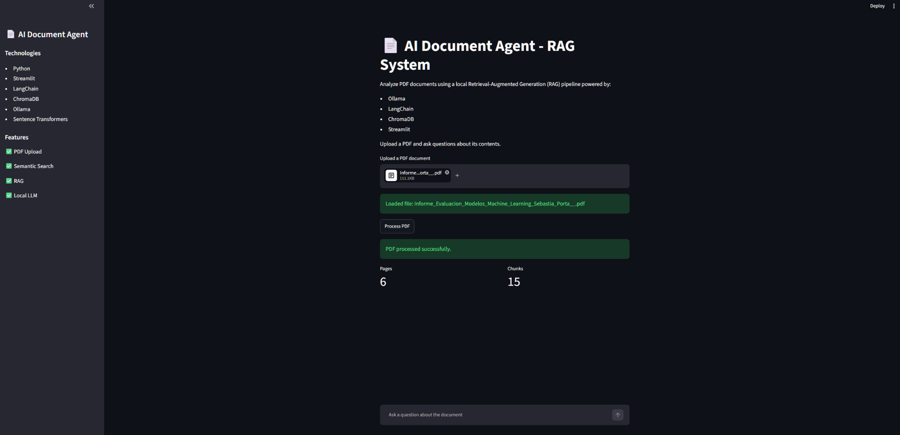
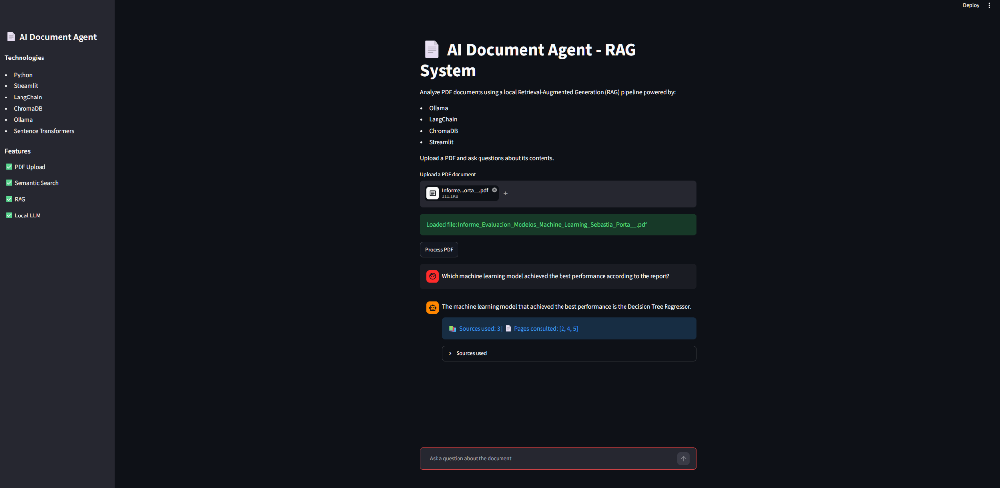

# 📄 AI Document Agent - RAG System

## Overview

AI Document Agent is a Retrieval-Augmented Generation (RAG) application that allows users to upload PDF documents and ask questions about their content using a local Large Language Model (LLM).

The project combines document processing, semantic search, vector databases, and generative AI to create an intelligent document assistant capable of retrieving relevant information and generating contextual answers.

---

## Features

* PDF document upload
* Automatic document processing
* Text chunking
* Semantic search
* Vector database storage with ChromaDB
* Local LLM inference using Ollama
* Conversational chat interface
* Source attribution
* Page citation tracking
* Retrieval statistics

---

## Technologies Used

### Artificial Intelligence

* Ollama
* LangChain
* Sentence Transformers
* ChromaDB

### Data Processing

* Python
* PyPDF
* Recursive Character Text Splitter

### Frontend

* Streamlit

---

## System Architecture

1. Upload PDF document
2. Extract text from PDF
3. Split text into chunks
4. Generate embeddings
5. Store embeddings in ChromaDB
6. Retrieve relevant chunks using semantic search
7. Generate answers with Ollama
8. Display answer, sources, and consulted pages

---

## Project Structure

```text
ai-document-agent/
│
├── app.py
│
├── data/
│
├── src/
│   ├── document_loader.py
│   ├── text_splitter.py
│   ├── embeddings.py
│   ├── vector_db.py
│   └── rag_chain.py
│
├── vectorstore/
│
├── requirements.txt
│
└── README.md
```

---

## Application Screenshots

### Initial Interface



---

### PDF Processing



---

### Question Answering with RAG



### Initial Interface

Upload and process PDF documents through a simple Streamlit interface.

### Document Processing

The system extracts text, creates chunks, generates embeddings, and stores them in a vector database.

### Question Answering

Users can ask questions about the uploaded document. The system retrieves relevant chunks, generates an answer, and displays the sources and pages consulted.

---

## Example Query

**Question**

```text
Which machine learning model achieved the best performance according to the report?
```

**Answer**

```text
The machine learning model that achieved the best performance is the Decision Tree Regressor.
```

**Sources**

```text
Pages consulted: [2, 4, 5]
```

---

## Future Improvements

* Multi-document support
* Chat memory
* Advanced retrieval strategies
* Re-ranking models
* Docker deployment
* Cloud deployment
* User authentication

---

## Learning Outcomes

This project allowed me to gain hands-on experience with:

* Retrieval-Augmented Generation (RAG)
* Vector databases
* Embedding models
* Semantic search
* Local LLM deployment
* Streamlit application development
* End-to-end AI system design

---

## Author

**Sebastià Porta Bentzen**

Junior Data Scientist | Junior AI Engineer

Python | SQL | Machine Learning | Azure | Power BI
